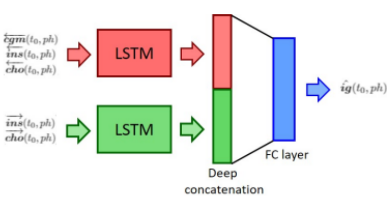
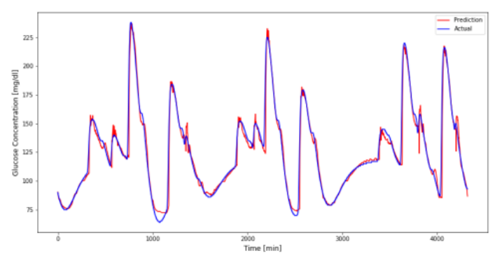

# DeepGlucoseForecasting

The project focuses on the implementation of an architecture for the estimation of blood glucose concentration levels. Glucose concentration depends mainly on the injected insulin
and on carbohydrate intake, which have opposite effects on glucose levels. In particular, an increase of insulin results in a decrease of glucose concentration, while
a meal intake produces a glucose rise. Thus, the inputs of the proposed model is composed by the three measurable signals represented respectively by the injected insulin (ins) recorded by subcutaneous insulin pump, the carbohydrate amount (cho) inserted manually by the patient, and the glucose concentration (cgm) measured by the CGM sensor. The output of the model is the interstitial (i.e. subcutaneous) glucose concentration (ig). The model that has been built is made of two parallel streams of LSTM units (Recurrent Neural Network):

## Network structrure:

## Prediction results:
